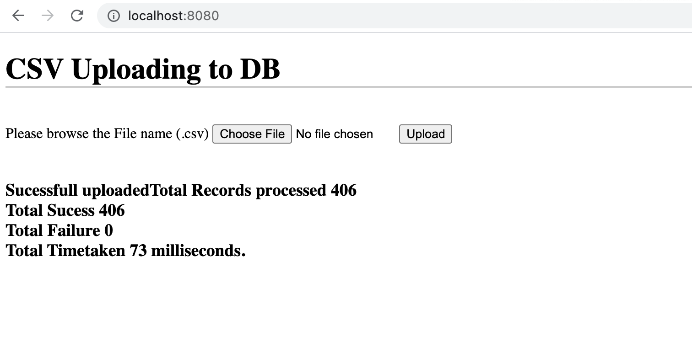

# Welcome to CSV upload Web Application

### Overview
This Web application created with Spring Boot and MongoDB with an option to upload a CSV file and the application should read the records, process it, and push to the database table.

### Language /Framework Used
 * Java 11+
 * SpringBoot - 2.5.3 (Spring Web and Spring Spring Data MongoDB)
 * MongoDB
 
### How to run the application
  * Import the project into your workspace.
  * Maven Install and Run as Spring Boot application.
  * Run the http://localhost:8080 in your browser to open upload page.
  * Browse the .CSV file file in the file upload and click "Submit" 
  * The REST end point process and upload to the MongoDB 
    http://localhost:8080/api/csv/upload
  * Refer the /src/main/resource/application.property file for MangoDB Host, Port and DB name.

### Output
 
  
   
  Thank you.!
